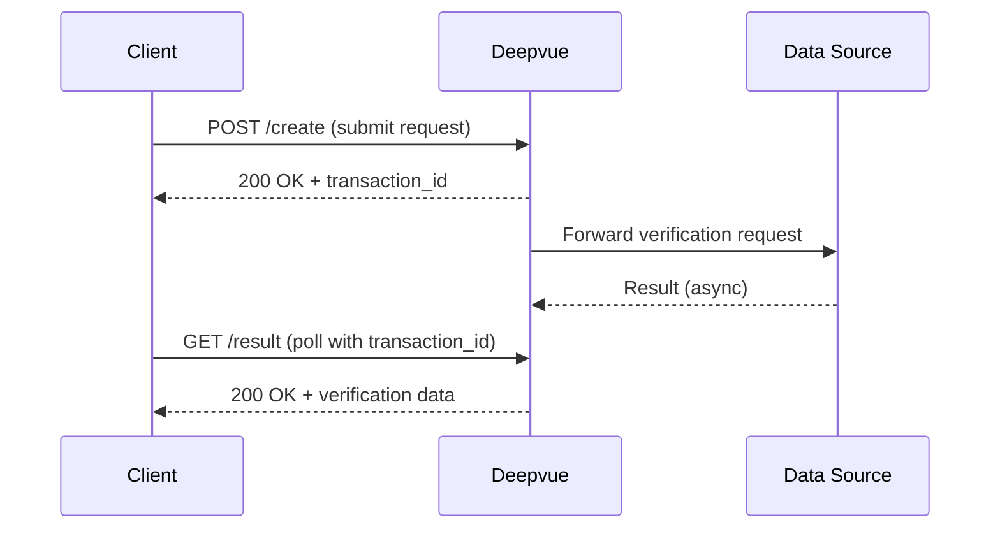

## Overview

Some Deepvue APIs use an asynchronous pattern where verification requests are submitted first and results are retrieved separately. This is common for verifications that depend on external government data sources with variable response times.

## How async endpoints work

Async endpoints follow a two-step **create → poll** pattern:



<Steps>
  <Step title="Submit the request" icon="upload" titleType="h3">
    Call the **create** endpoint with the required parameters. The API returns a `transaction_id` immediately without waiting for the data source to respond.

    ```bash
    curl -X POST "https://production.deepvue.tech/v1/verification/post-driving-license" \
      -H "Authorization: Bearer YOUR_ACCESS_TOKEN" \
      -H "x-api-key: YOUR_CLIENT_SECRET" \
      -H "Content-Type: application/json" \
      -d '{"dl_number": "DL1234567890", "dob": "1990-01-01", "consent": "Y", "reason": "KYC"}'
    ```
  </Step>

  <Step title="Store the transaction ID" icon="save" titleType="h3">
    The create endpoint returns a `transaction_id`. Store this value — you will need it to retrieve the result.

    ```json
    {
      "code": 200,
      "transaction_id": "abc123def456",
      "message": "Request accepted"
    }
    ```
  </Step>

  <Step title="Poll for the result" icon="refresh-cw" titleType="h3">
    Call the **result** endpoint with the `transaction_id` to check if the verification is complete.

    ```bash
    curl -X GET "https://production.deepvue.tech/v1/verification/get-driving-license?transaction_id=abc123def456" \
      -H "Authorization: Bearer YOUR_ACCESS_TOKEN" \
      -H "x-api-key: YOUR_CLIENT_SECRET"
    ```

    <Callout kind="info">
      If the result is not yet available, the API returns a `202` status with a message indicating the request is still being processed. Retry after a short delay.
    </Callout>
  </Step>
</Steps>

## Recommended polling strategy

<Callout kind="tip">
  Most async results are available within 5–30 seconds. Use exponential backoff starting at 3 seconds to avoid unnecessary API calls.
</Callout>

<CodeGroup tabs="Python,JavaScript">
  ```python
  import time
  import requests

  def poll_for_result(transaction_id, headers, max_attempts=10):
      url = f"https://production.deepvue.tech/v1/verification/get-driving-license"
      delay = 3

      for attempt in range(max_attempts):
          response = requests.get(
              url,
              params={"transaction_id": transaction_id},
              headers=headers
          )

          if response.status_code == 200:
              data = response.json()
              if data.get("data"):
                  return data  # Result is ready

          time.sleep(delay)
          delay = min(delay * 2, 30)  # Cap at 30 seconds

      raise TimeoutError("Result not available after maximum attempts")
  ```

  ```javascript
  async function pollForResult(transactionId, headers, maxAttempts = 10) {
    const url = "https://production.deepvue.tech/v1/verification/get-driving-license";
    let delay = 3000;

    for (let attempt = 0; attempt < maxAttempts; attempt++) {
      const response = await fetch(
        `${url}?transaction_id=${transactionId}`,
        { headers }
      );

      if (response.ok) {
        const data = await response.json();
        if (data.data) return data; // Result is ready
      }

      await new Promise(resolve => setTimeout(resolve, delay));
      delay = Math.min(delay * 2, 30000); // Cap at 30 seconds
    }

    throw new Error("Result not available after maximum attempts");
  }
  ```
</CodeGroup>

## Best practices

- **Store transaction IDs persistently** — Save them in your database so you can retry polling if your process restarts.
- **Don't poll too aggressively** — Excessive polling counts toward your [rate limits](/rate-limits). Start at 3 seconds and increase the interval.
- **Set a timeout** — If a result hasn't arrived after 2–3 minutes, log the transaction ID and contact support.
- **Handle partial results** — Some endpoints may return partial data while processing continues. Check the response status fields before using the data.
- **Use bulk endpoints for volume** — If you need to verify many records, consider the [Bulk Validations](/reference/bulk-verification/introduction) endpoints instead of making individual async requests.
