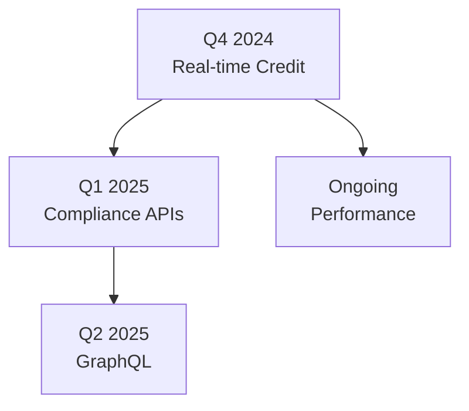

## Recent Updates

<Update label="2024-10-15" description="v2.1.0" tags={["feature", "improvement"]}>

## New Features

- Added new `/v1/banking/transactions` endpoint for real-time transaction history retrieval.
- Introduced webhook support for identity verification events with customizable payloads.

## Improvements

- Enhanced response times for credit score queries by `>30%`.
- Added pagination support to all list endpoints with `limit` and `offset` parameters.

## Bug Fixes

- Fixed intermittent 500 errors in `/v1/identity/verify` endpoint.
- Resolved token expiration issues during long-running batch operations.

</Update>

<Update label="2024-09-20" description="v2.0.0" tags={["feature", "breaking"]}>

## New Features

- Launched Banking API suite with endpoints for account balances and transfers.
- Added multi-factor authentication support for API keys.

## Breaking Changes

- Changed default response format from XML to JSON only.
- Updated `/v1/credit/score` endpoint to require `user_id` as path parameter instead of query.

## Bug Fixes

- Corrected rate limiting logic to properly reset daily quotas.

</Update>

<Update label="2024-08-10" description="v1.5.0" tags={["bugfix", "improvement"]}>

## Improvements

- Optimized database queries for identity verification reducing latency to `<100ms`.
- Added detailed error codes for all authentication failures.

## Bug Fixes

- Fixed CORS issues affecting browser-based SDK integrations.
- Patched potential security vulnerability in token validation (CVE-2024-XXXX).

</Update>

## Breaking Changes Summary

<Callout kind="alert" title="Review Breaking Changes">
All breaking changes are announced at least 30 days in advance via email and the dashboard. Migrate using the guides below to avoid disruptions.
</Callout>

| Version | Change | Impact | Migration Guide |
|---------|--------|--------|-----------------|
| v2.0.0 | Response format to JSON-only | Medium | Update client parsers |
| v2.0.0 | `user_id` as path param | Low | Adjust endpoint calls |

## Deprecations and Migrations

<Steps>
  <Step title="Identify Deprecated Endpoints" icon="search">
    Check your API dashboard at [https://dashboard.deepvue.tech/](https://dashboard.deepvue.tech/) for deprecation warnings.
  </Step>
  <Step title="Update Code" icon="code">
    Replace deprecated paths. Example migration:
    
    <CodeGroup tabs="Before,After">
    ````javascript
    // Old: /v1/credit/score?user_id=123
    fetch('https://production.deepvue.tech/v1/credit/score?user_id=123');
    ````
    
    ````javascript
    // New: /v1/credit/score/{user_id}
    fetch('https://production.deepvue.tech/v1/credit/score/123');
    ````
    </CodeGroup>
  </Step>
  <Step title="Test and Deploy" icon="check-circle">
    Run integration tests against staging: `https://staging.deepvue.tech`.
  </Step>
</Steps>

## New Endpoints Added

- `POST /v1/banking/accounts` - Create virtual bank accounts.
- `GET /v1/identity/documents/{id}` - Retrieve verification documents.

<Callout kind="success">
Explore new endpoints in the [API Reference](/introduction).
</Callout>

## Future Roadmap

<Columns cols={3}>
  <Card title="Q4 2024" icon="zap" href="#future-q4">
    Real-time credit monitoring and AI-driven fraud detection.
  </Card>
  <Card title="Q1 2025" icon="shield" href="#future-q1">
    Expanded compliance APIs for GDPR and PCI-DSS.
  </Card>
  <Card title="Q2 2025" icon="trending-up" href="#future-q2">
    GraphQL support and advanced analytics dashboards.
  </Card>
</Columns>

<Expandable title="Detailed Roadmap Timeline" default-open="false">

</Expandable>