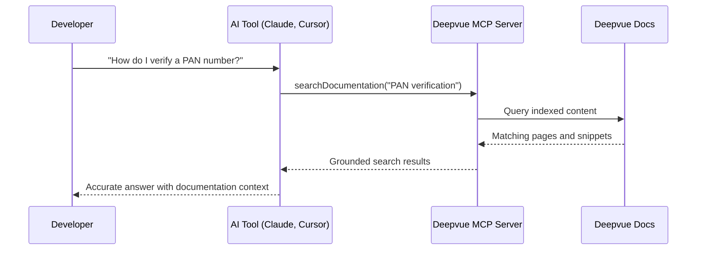

## Overview

Deepvue provides an MCP (Model Context Protocol) server that allows external AI tools to search and retrieve information from this documentation. The server exposes a single tool, `searchDocumentation`, which performs grounded search using the same ranking algorithm as the in-app AI assistant.

This means AI tools like Claude, Cursor, ChatGPT, and other MCP-compatible clients can access Deepvue's API documentation directly — helping developers get accurate, up-to-date answers about Deepvue APIs without leaving their workflow.

## MCP server endpoint

```
https://deepvue.documentationai.com/_mcp
```

## Capabilities

| Feature | Details |
|---------|---------|
| **Tool** | `searchDocumentation` — query indexed documentation |
| **Search scope** | All pages, headings, API references, and code snippets |
| **Access** | Read-only — no content modification |
| **Availability** | Automatic — no API key required |

## Connect to the MCP server

<Tabs>
  <Tab title="Claude Desktop" icon="bot">
    Add the following to your Claude Desktop MCP configuration file (`claude_desktop_config.json`):

    ```json
    {
      "mcpServers": {
        "deepvue-docs": {
          "url": "https://deepvue.documentationai.com/_mcp"
        }
      }
    }
    ```

    Once configured, Claude will automatically search Deepvue documentation when you ask questions about Deepvue APIs.
  </Tab>

  <Tab title="Claude Code" icon="terminal">
    Add the MCP server to your project's `.mcp.json` file:

    ```json
    {
      "mcpServers": {
        "deepvue-docs": {
          "type": "url",
          "url": "https://deepvue.documentationai.com/_mcp"
        }
      }
    }
    ```

    Claude Code will use the Deepvue documentation as context when answering questions about your integration.
  </Tab>

  <Tab title="Cursor" icon="code">
    In Cursor, go to **Settings → MCP** and add a new server:

    - **Name**: `deepvue-docs`
    - **URL**: `https://deepvue.documentationai.com/_mcp`

    Cursor will invoke `searchDocumentation` automatically when it needs context about Deepvue APIs.
  </Tab>
</Tabs>

## Example usage

Once connected, you can ask your AI tool questions like:

- "How do I authenticate with the Deepvue API?"
- "What parameters does the PAN Basic verification endpoint accept?"
- "Show me how to implement exponential backoff for rate limits"
- "What is the async polling pattern for driver license verification?"
- "What consent parameters are required for KYC verification?"

The AI tool will search Deepvue's documentation and return grounded answers with accurate, up-to-date information.

## How it works



<Callout kind="info">
  The MCP server provides access to all public documentation only. The same content available on this documentation site is searchable through the MCP server.
</Callout>
